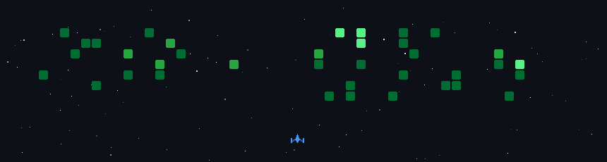

<h1 align="center">Hello, I am Kantesh 👋</h1>

  <a href="https://github.com/KanteshMurade">GitHub</a> •
  <a href="https://www.linkedin.com/">LinkedIn</a> •
  <a href="mailto:kanteshmurade@gmail.com">Email</a>

  

 

---

<h2 align="center">🕹️ My GitHub Activity Game</h2>

  

---

<h2 align="center">⚡ Tech Stack</h2>

  

---

<h2 align="center">📫 Connect With Me</h2>

  
  
  

